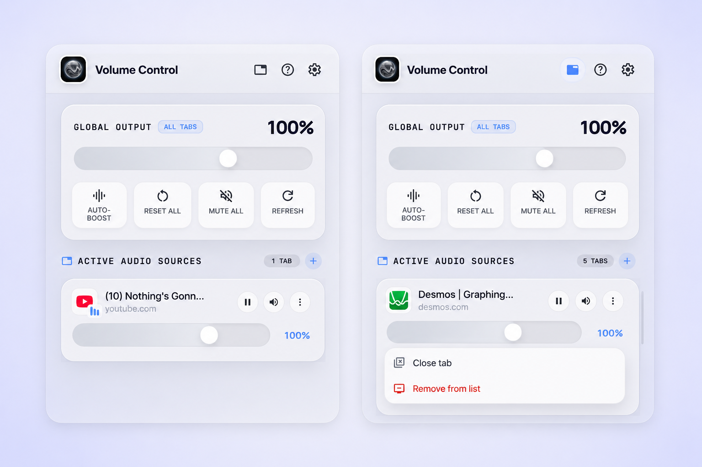
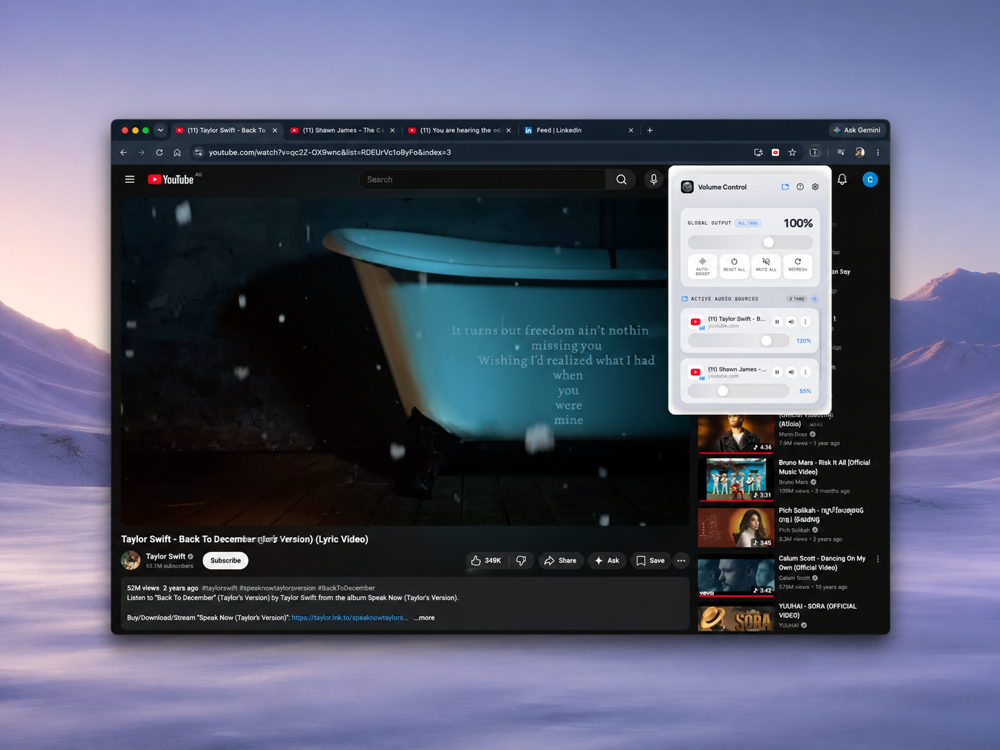
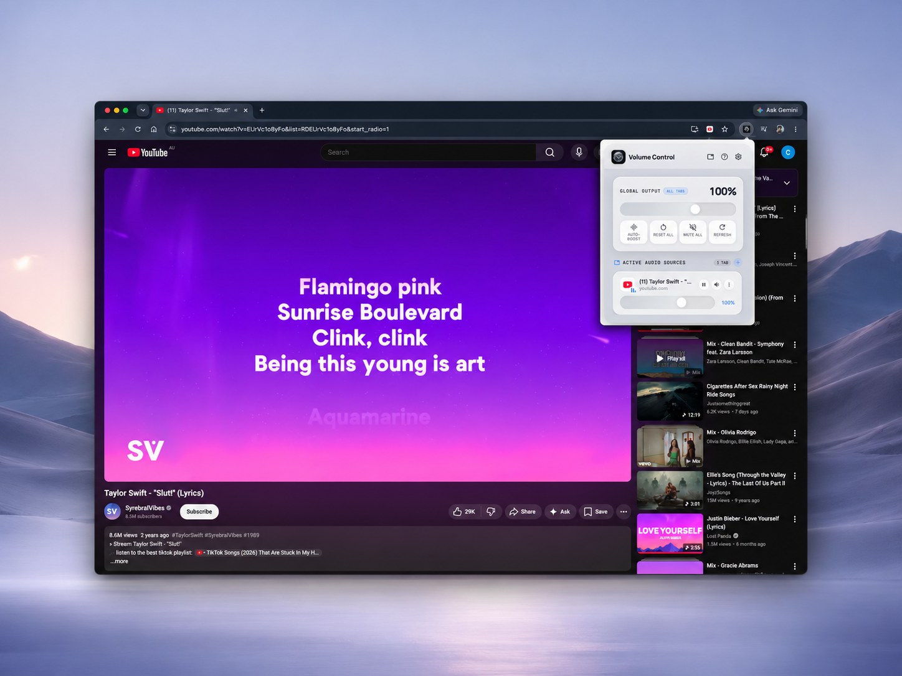

<div align="center">


<br><br>

[](https://developer.chrome.com/docs/extensions/mv3/intro/)
[](LICENSE)
[](https://developer.chrome.com/docs/extensions/)
[](https://github.com/ChinhFey/chrome-extension-volume-mixer#privacy--security)
[](https://github.com/ChinhFey/chrome-extension-volume-mixer/stargazers)

### The premium per-tab volume mixer for Chrome — control every tab's audio independently with a beautiful liquid glass UI.

[Install Guide](#-installation) · [Features](#-features) · [How It Works](#-how-it-works) · [Privacy](#-privacy--security) · [Contributing](#-contributing)

</div>

---

## ✨ Overview

**Volume Controller** is a free, open-source Chrome Extension that gives you a dedicated **volume mixer** for every browser tab — just like Windows Volume Mixer, but built natively into Chrome.

Adjust, mute, boost, or pause audio on any tab — YouTube, Spotify Web, Twitch, podcasts, video calls — all from one elegant glassmorphism popup. No account. No tracking. No remote code. 100% local.

> **Perfect for:** streamers, music lovers, multitaskers, students, remote workers, and anyone who hates having tabs blast audio unexpectedly.

---

## 📸 Screenshots



<br>

<table>
  <tr>
    <td></td>
    <td></td>
  </tr>
  <tr>
    <td align="center"><em>Single tab — full control</em></td>
    <td align="center"><em>Multiple tabs — independent sliders</em></td>
  </tr>
</table>

---

## 🚀 Features

| Feature | Description |
|---|---|
| 🎚️ **Per-Tab Volume Sliders** | Control each tab's volume from 0% to 150% independently |
| 🌐 **Global Output Master** | One slider to rule all tabs simultaneously |
| 🔇 **Mute / Unmute** | Instantly silence any tab without losing its volume setting |
| ⏸️ **Pause / Resume Media** | Pause all media on a tab directly from the popup |
| ⚡ **Auto-Boost** | Boost all tabs to 150% with one click |
| 🔄 **Reset All** | Return all tabs to 100% in one click |
| 🔕 **Mute All** | Silence every tab at once |
| 📌 **Audible Tabs First** | Tabs currently playing audio always float to the top |
| ➕ **Restore Removed Tabs** | Add tabs back after removing them from the list |
| 🌊 **Live Waveform** | Animated audio bars next to playing tabs |
| 💾 **Persistent Settings** | Volume levels survive page reloads and tab navigations |
| 🎨 **Liquid Glass UI** | Premium frosted glass aesthetic, smooth spring animations |

---

## 📦 Installation

> **Chrome Web Store listing coming soon.** For now, install it manually in under 30 seconds.

### Step 1 — Download

```bash
git clone https://github.com/ChinhFey/chrome-extension-volume-mixer.git
```

Or [Download ZIP →](https://github.com/ChinhFey/chrome-extension-volume-mixer/archive/refs/heads/main.zip) and unzip it.

### Step 2 — Enable Developer Mode

1. Open Chrome and go to `chrome://extensions`
2. Toggle **Developer mode** ON (top right corner)

### Step 3 — Load the Extension

1. Click **Load unpacked**
2. Select the `chrome-extension-volume-mixer` folder
3. The **Volume Controller** icon appears in your toolbar

### Step 4 — Use It

1. Open any tab playing audio (YouTube, Spotify, Twitch…)
2. Click the **Volume Controller** icon in the Chrome toolbar
3. Use the sliders to mix your audio

---

## 🛠 How It Works

Volume Controller uses the **Web Audio API** to intercept and control audio at the browser tab level — without modifying websites or requiring any server.

```
[Chrome Tab Audio]
       │
       ▼
[injected.js — MAIN world]
  AudioContext intercepted at document_start
  GainNode inserted before audio destination
  HTMLMediaElement.volume overridden
       │
       ▼
[background.js — Service Worker]
  chrome.scripting.executeScript (world: MAIN)
  Sets gain.value directly on the GainNode
  Persists volumes via chrome.storage.session
       │
       ▼
[popup.js — UI Layer]
  Per-tab sliders → sendMessage → background
  Global slider → updates all visible tab cards
  Live tab detection via chrome.tabs events
```

**Why `world: MAIN`?**
Chrome MV3 content scripts run in an isolated world by default. To control actual `AudioContext` gain nodes created by the page (YouTube's player, Spotify's engine, etc.), the script must run in the **MAIN** JavaScript context. This is why `injected.js` uses `world: "MAIN"` — it's the only reliable way to hook into real audio pipelines.

---

## 🔒 Privacy & Security

Volume Controller is built with **zero-trust privacy** principles:

| Claim | Details |
|---|---|
| ✅ **No data collected** | We collect absolutely nothing. No analytics, no telemetry, no crash reports |
| ✅ **No remote code** | All code runs locally. No CDN scripts, no external fetches |
| ✅ **No account required** | No sign-up, no login, no email |
| ✅ **No network requests** | The extension never makes any outbound HTTP calls |
| ✅ **Open source** | Every line of code is public and auditable right here |
| ✅ **Manifest V3** | Built on Chrome's latest, most secure extension platform |
| ✅ **Minimal permissions** | Only `tabs`, `storage`, `scripting` — no `<all_urls>` data access |
| ✅ **Session-only storage** | Volumes stored in `chrome.storage.session` — cleared when Chrome closes |

**You can audit the full source code in minutes.** There are no minified bundles, no obfuscated code, and no build step — what you see is what runs.

---

## 🧱 Tech Stack

| Layer | Technology |
|---|---|
| **Platform** | Chrome Extension — Manifest V3 |
| **Audio Engine** | Web Audio API (`AudioContext`, `GainNode`) |
| **UI** | Vanilla HTML + CSS (glassmorphism / liquid glass) |
| **Logic** | Vanilla JavaScript (ES2020+) |
| **Fonts** | Manrope, Inter, JetBrains Mono (Google Fonts) |
| **Icons** | Material Symbols Outlined |
| **Storage** | `chrome.storage.session` + `localStorage` |
| **Scripting** | `chrome.scripting.executeScript` (MAIN world) |

No frameworks. No bundlers. No dependencies. Pure browser APIs.

---

## 📁 Project Structure

```
chrome-extension-volume-mixer/
├── manifest.json       # Extension manifest (MV3)
├── background.js       # Service worker — volume logic, tab events
├── injected.js         # MAIN world script — AudioContext hook
├── content.js          # Isolated world bridge
├── popup.html          # Extension popup UI
├── popup.css           # Glassmorphism styles + animations
├── popup.js            # Popup interactivity
├── icons/
│   └── logo.png        # Extension icon
└── assets/             # README screenshots
```

---

## 🗺️ Roadmap

- [ ] Chrome Web Store release
- [ ] Keyboard shortcuts for quick mute/boost
- [ ] Per-tab volume memory across sessions
- [ ] Dark mode support
- [ ] Firefox / Edge port
- [ ] Mini mode (compact popup)

---

## 🤝 Contributing

Contributions are welcome! This is a solo open-source project and any help is appreciated.

1. Fork the repo
2. Create a branch: `git checkout -b feat/your-feature`
3. Make your changes
4. Open a pull request

Please keep PRs focused — one feature or fix per PR.

---

## ⭐ Support

If Volume Controller saved your sanity during a late-night YouTube session, consider:

- ⭐ **Starring this repo** — it helps others discover it
- 🐛 **Reporting bugs** via [Issues](https://github.com/ChinhFey/chrome-extension-volume-mixer/issues)
- 💡 **Suggesting features** via [Discussions](https://github.com/ChinhFey/chrome-extension-volume-mixer/discussions)
- 📢 **Sharing it** with anyone who needs per-tab volume control

---

## 📄 License

MIT License — free to use, modify, and distribute.

```
Copyright (c) 2026 ChinhFey

Permission is hereby granted, free of charge, to any person obtaining a copy
of this software and associated documentation files (the "Software"), to deal
in the Software without restriction, including without limitation the rights
to use, copy, modify, merge, publish, distribute, sublicense, and/or sell
copies of the Software, and to permit persons to whom the Software is
furnished to do so, subject to the following conditions:

The above copyright notice and this permission notice shall be included in all
copies or substantial portions of the Software.

THE SOFTWARE IS PROVIDED "AS IS", WITHOUT WARRANTY OF ANY KIND, EXPRESS OR
IMPLIED, INCLUDING BUT NOT LIMITED TO THE WARRANTIES OF MERCHANTABILITY,
FITNESS FOR A PARTICULAR PURPOSE AND NONINFRINGEMENT.
```

---

<div align="center">

Built with ❤️ by [ChinhFey](https://github.com/ChinhFey)

**Volume Controller** — the last volume extension you'll ever need.

*Keywords: chrome extension volume control, per tab volume mixer, chrome tab audio control, browser volume mixer, tab volume controller, chrome audio mixer, youtube volume control extension, web audio api chrome extension, volume booster chrome, mute tab chrome, chrome sound mixer, audio control chrome extension, tab audio manager, chrome volume per tab, browser audio mixer*

</div>
